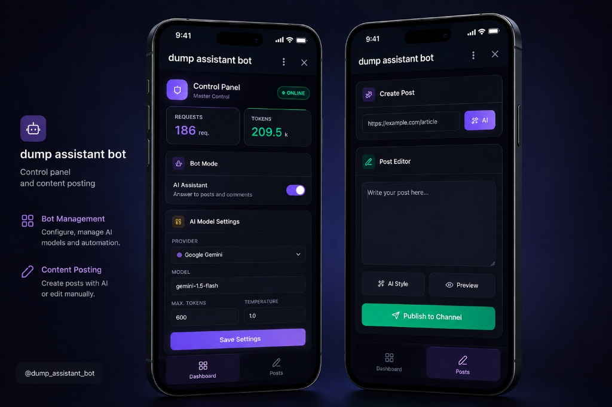

# Dump Assistant Bot

[English version](README.md) | [Русская версия](README.ru.md)


A smart AI assistant for Telegram channels and discussion groups. The bot reads channel posts, tracks thread context, analyzes links, answers subscriber questions, and can automatically leave the first comment under new posts.

By default, the project is configured to use the Gemini cloud model. OpenAI and local Ollama models remain supported alternatives.

## Features

- **Telegraph Longreads & Articles (`/article`):** Automatically format and publish longform articles and drafts directly to Telegraph with native **Instant View** preview in the channel.
- **🎨 Brand AI Cover Generation (Google Gemini & FLUX):** If no cover image is attached, AI drafts a visual prompt and generates a widescreen 16:9 illustration in the DUMP brand visual style (Cyber, Solar, Emerald, Void palettes) via **Google Gemini** (`gemini-2.5-flash-image`) with cascade fallback to Pollinations FLUX. Strictly filters out text and typography artifacts.
- **🏷 Smart Hashtags:** Automatically extracts and appends 3–6 relevant hashtags for navigation.
- **Expandable Blockquotes (`<blockquote expandable>`):** Formats extensive parameters, quotes, and technical details into Telegram expandable quotes (`**>` / `> [!expandable]`).
- **Native Formatting (Telegram Bot API 10.2+):** The bot supports sending Rich Messages (native tables, lists, LaTeX formulas) by converting Markdown to HTML using the `marked` library. It includes full support for native math rendering (`tg-math` and `tg-math-block`) and an automatic safety fallback to standard text messages for older Telegram clients.
- **Ephemeral Replies in Groups:** The bot can reply to comments in group discussions with private (ephemeral) messages visible only to the specific user who asked. This prevents chat clutter in public comment threads.
- **Cloud-first LLM:** Gemini API is the recommended mode, requiring no local model installation.
- **OpenAI-compatible Mode:** Switch easily to OpenAI API or any compatible endpoint.
- **Local Mode:** Ollama is preserved as an optional/legacy option for hosting on your own hardware.
- **Post Context Caching:** Caches new channel posts to answer questions with full context of the original publication.
- **Link Reading:** If a post or query contains a URL, the bot downloads the page content and incorporates it into the LLM prompt.
- **First Comment Mode:** Automatically leaves a brief comment under new channel posts.
- **Post Publishing (via DM):** The owner can send `/post <Markdown text>` (with optional image) directly to the bot to publish beautiful Rich posts to the channel. Media files are saved to the Vercel site's `public/media` folder and served via a persistent URL. Posts longer than 3800 characters automatically route to Telegraph article mode.
- **Publishing from Links:** Send any link to the bot's DM. It automatically downloads the page content, generates a structured post using AI, appends the source link, and publishes it. Alternatively, use `/postlink <url>`.
- **Owner Commands:** `/article`, `/post`, `/postlink`, `/ephemeral`, `/status`, `/usage`, `/on`, `/off`, `/chatid`.
- **Anti-spam & Focus:** Only replies to direct mentions, questions, and helpful requests, ignoring noise.

## Quick Start

### 1. Installation

Requires Node.js 22+.

```bash
npm install
```

### 2. Configure `.env`

Create a local configuration file:

```bash
cp .env.example .env
```

Fill in the required fields:

```env
TELEGRAM_BOT_TOKEN=your_telegram_bot_token
BOT_USERNAME=your_bot_username
ALLOWED_CHAT_IDS=-1001234567890
ALLOW_ALL_CHATS=false
OWNER_USER_IDS=123456789
CHANNEL_CHAT_ID=-1001234567890
CHANNEL_USERNAME=dump_dump
WEBAPP_URL=https://your-domain.ngrok-free.app/app

LLM_PROVIDER=gemini
GEMINI_API_KEY=your_gemini_api_key
GEMINI_MODEL=gemini-3.5-flash-lite
```

Where:

- `TELEGRAM_BOT_TOKEN` - Token from [@BotFather](https://t.me/BotFather).
- `BOT_USERNAME` - Bot username without the `@`.
- `ALLOWED_CHAT_IDS` - Comma-separated list of allowed group or channel IDs.
- `ALLOW_ALL_CHATS` - Open mode for all chats. Disabled by default.
- `OWNER_USER_IDS` - Comma-separated list of Telegram IDs of bot owners.
- `CHANNEL_CHAT_ID` - Channel ID for publishing posts via `/post` (starts with `-100`).
- `CHANNEL_USERNAME` - Channel username without `@` used in onboarding links (default: `dump_dump`).
- `WEBAPP_URL` - Public HTTPS URL of the Mini App admin panel (scopes menu button exclusively to owners).
- `LLM_PROVIDER` - One of: `gemini`, `openai`, `ollama`.

### 3. Telegram Setup

1. In [@BotFather](https://t.me/BotFather), open `Bot Settings` -> `Group Privacy` and disable privacy mode.
2. Add the bot to your channel's discussion group.
3. Grant the bot permissions to read and send messages.
4. Start the bot:

```bash
npm start
```

### 4. Web App Admin Panel & Scoped UI

The bot includes an Express web server hosting a Telegram Mini App admin panel for adjusting AI settings, checking token usage, and publishing posts in the "Composer" tab.



#### Interface Protection & Scoped Menu Button:
* **Guests never see the admin UI**: on startup, the bot invokes `setChatMenuButton` to reset the default menu button for all regular visitors.
* **Owners receive the Web App button**: the bot scopes the Telegram `web_app` menu button exclusively to IDs in `OWNER_USER_IDS` whenever `WEBAPP_URL` is configured.
* **Quick Access on `/start`**: sending `/start` as an owner returns an inline "🛠 Панель управления" button to open the Mini App in one tap.

#### One-Click Launch on Windows:
Run the [start.bat](start.bat) file in the root directory. It automatically opens separate command prompts and runs:
1. The local bot server (`npm start` on port `3001` or as specified in `PORT`).
2. An `ngrok` tunnel mapping your dev domain.

#### Manual Launch & Tunnel Configuration:
1. Install [ngrok](https://ngrok.com) and add your authtoken:
   ```bash
   ngrok config add-authtoken <YOUR_TOKEN>
   ```
2. Start the bot:
   ```bash
   npm start
   ```
3. Open a tunnel for the bot's port (default: `3001`):
   ```bash
   ngrok http --domain=your-domain.ngrok-free.app 3001
   ```
4. Set the resulting URL in `.env`:
   ```env
   WEBAPP_URL=https://your-domain.ngrok-free.app/app
   ```
   The bot will automatically scope the menu button to owners on startup.

> [!TIP]
> To access the admin panel directly via a regular web browser without Telegram authentication, add the following to your `.env`:
> ```env
> BYPASS_INIT_DATA_AUTH=true
> ```

### 5. Private DM Onboarding (Guests vs Owners)

* **For Guests (Visitors / Subscribers):**
  - Sending `/start` presents an interactive greeting with 4 action buttons:
    - `ℹ️ Что умеет бот` — Explains comment answering, link summarization, and admin relay.
    - `📢 Открыть канал` — Direct link to the channel.
    - `❓ Задать вопрос` — Clarifies that AI Q&A occurs in channel post comments.
    - `✍️ Написать админу` — Activates message relay to the channel owner.
  - **No Owner Spam**: tapping info buttons and repeated `/start` commands generate zero notifications for the owner.
  - **Admin Contact (Relay)**: when tapping "Написать админу", the visitor's next message is forwarded to the owner. The owner can reply directly using Telegram's native Reply feature.
  - **Owner Audit for Free Text**: spontaneous visitor DMs receive a polite guidance prompt with channel buttons, and a compact audit message (`[Audit DM]`) is dispatched to the owner with rate-limiting (60s cooldown). The owner can reply to the audit message to contact the visitor.

* **BotFather Suggestions:**
  - **About:** Official AI assistant for @dump_dump. Post discussion answers, link summaries, and creator feedback.
  - **Description:** Hi! I am the AI assistant for @dump_dump. I answer questions in comment discussions, summarize links, and forward feedback to the channel author. Open the channel or tap /start!

## LLM Providers

### Gemini (Recommended)

```env
LLM_PROVIDER=gemini
GEMINI_API_KEY=your_gemini_api_key
GEMINI_MODEL=gemini-3.5-flash-lite
GEMINI_BASE_URL=https://generativelanguage.googleapis.com/v1beta
LLM_TIMEOUT_MS=30000
```

Fast, requires no local hardware or GPU, supports Structured Outputs natively.

### OpenAI or Compatible API (Grok, OpenRouter, etc.)

```env
LLM_PROVIDER=openai
OPENAI_API_KEY=your_api_key
OPENAI_MODEL=gpt-4o-mini  # Alternatives: gpt-4o, o3-mini, grok-3-mini, grok-3, deepseek/deepseek-r1:free
OPENAI_BASE_URL=https://api.openai.com/v1
LLM_TIMEOUT_MS=30000
```

Supports any OpenAI `/chat/completions` compatible API endpoints:
- **OpenAI:** `gpt-4o-mini` (fast), `gpt-4o` (flagship), `o3-mini` (reasoning).
- **xAI Grok:** `grok-3-mini`, `grok-3` (set `OPENAI_BASE_URL=https://api.x.ai/v1`).
- **OpenRouter:** `deepseek/deepseek-r1:free`, `meta-llama/llama-3.3-70b-instruct:free` (set `OPENAI_BASE_URL=https://openrouter.ai/api/v1`).

### Local / Legacy Ollama

Local mode preserved for users requiring total privacy or offline LLM execution.

```bash
ollama pull qwen2.5:3b-instruct
```

```env
LLM_PROVIDER=ollama
OLLAMA_MODEL=qwen2.5:3b-instruct  # Alternatives: llama3.2:3b, deepseek-r1:1.5b
OLLAMA_BASE_URL=http://127.0.0.1:11434
OLLAMA_NUM_CTX=4096
OLLAMA_NUM_PREDICT=200
LLM_TIMEOUT_MS=120000
```

Ensures maximum privacy and works offline on your own machine.

## Migration from Ollama to Cloud

1. In `.env`, change `LLM_PROVIDER=ollama` to `LLM_PROVIDER=gemini`.
2. Add your `GEMINI_API_KEY`.
3. Set `GEMINI_MODEL=gemini-3.5-flash-lite`.
4. Reduce `LLM_TIMEOUT_MS` to `30000` (from `120000`).
5. Restart the bot.

Ollama environment variables can be left in `.env`: they are ignored unless `LLM_PROVIDER` is set to `ollama`.

## Commands

- `/article <text>` - Format and publish longread to Telegraph with Instant View, brand Gemini AI cover, and hashtags.
- `/articleraw <text>` - Publish directly to Telegraph without LLM reformatting.
- `/post <text>` - Publish markdown post to channel (sent via DM to the bot, supports Markdown and attaching one image).
- `/postlink <url>` - Generate and publish a post based on link content. Also works by sending a bare link without the command.
- `/ephemeral <on/off>` - Enable or disable private (ephemeral) replies in groups. Shows current status if called without arguments.
- `/chatid` - Show ID of the current chat and thread.
- `/status` - Show active mode, model, and database stats.
- `/usage` - Show detailed token and request usage statistics.
- `/on` - Enable automatic replies.
- `/off` - Disable automatic replies.

Commands are restricted to user IDs defined in `OWNER_USER_IDS`.

## Behavior Settings

The core system prompt is located in `prompts/assistant.md`. You can adjust tone, style, and rules there without editing code.

Additional environment variables:

- `CHANNEL_ABOUT` - Brief description of the channel for context.
- `AUTO_REPLY_ENABLED` - Automatically enable replies on startup.
- `MAX_REPLY_CHARS` - Maximum length of the generated reply.
- `THREAD_COOLDOWN_MS` - Cooling period between replies in the same thread.
- `RECENT_MESSAGES_LIMIT` - Number of previous messages loaded for context.
- `URL_FETCH_TIMEOUT_MS` - Timeout for web scraping.
- `WEBSITE_REPO_PATH` - Path to Vercel website folder (e.g., `portfolio-clone`).
- `MEDIA_PUBLIC_BASE_URL` - Public URL for uploaded media (e.g., `https://alevoldon.com/media`).
- `MEDIA_AUTO_DEPLOY` - Automatically commit and push media to Git (`true`/`false`).
- `LOG_LEVEL` - Logging level: `error`, `warn`, `info`, `debug`.

## Verification

Run lint check and tests:

```bash
npm run check
npm test
```

For the website landing page:

```bash
cd website
npm run build
```

## Deployment

### Docker

```bash
cp .env.example .env
# fill in .env

docker compose up -d --build
```

The `data/` folder is mounted as a volume to persist state and post caches between restarts.

### Running on VPS

```bash
npm ci --omit=dev
npm start
```

Use `pm2`, `systemd`, or similar tool for background daemon management. The bot saves state in `data/state.json` on exit.

### CI/CD

The repository includes GitHub Actions (`.github/workflows/ci.yml`): syntax checks, unit tests, and landing page build verification.
