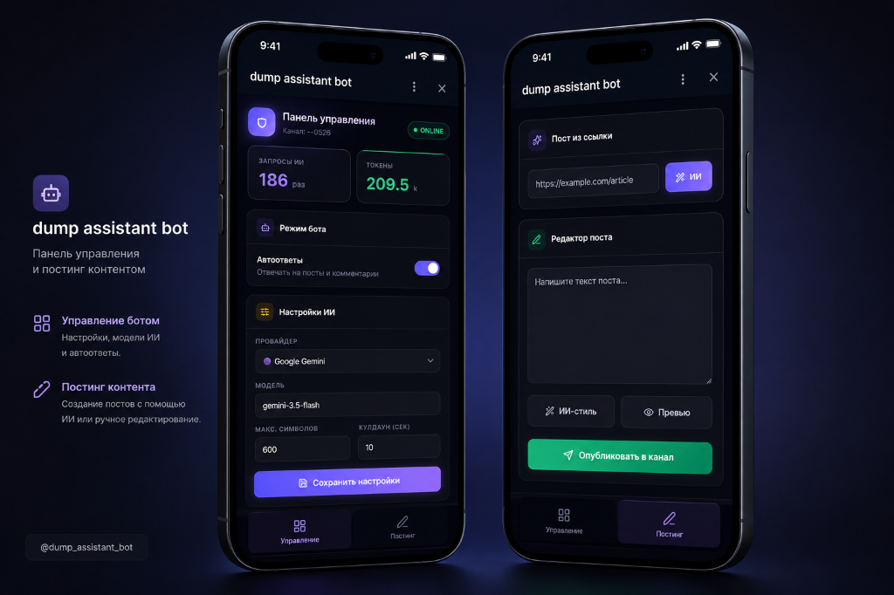

# Dump Assistant Bot

[English version](README.md) | [Русская версия](README.ru.md)


Умный ИИ-ассистент для Telegram-канала и группы обсуждений. Бот читает посты, учитывает контекст треда, анализирует ссылки, отвечает на вопросы подписчиков и может оставлять первый комментарий под новым постом.

По умолчанию проект настроен на облачную модель Gemini. OpenAI и локальная Ollama-модель остаются поддерживаемыми альтернативами.

## Возможности

- **Нативное форматирование (Telegram Bot API 10.2):** бот поддерживает отправку Rich Messages (нативные таблицы, списки, LaTeX-формулы) через конвертацию Markdown в HTML с помощью библиотеки `marked`. Реализована полноценная поддержка математического рендеринга (`tg-math` и `tg-math-block`) и авто-откат (fallback) для старых клиентов Telegram.
- **Приватные ответы в группах (Ephemeral Replies):** бот умеет отвечать пользователям в комментариях группы приватными сообщениями (эфемерными), которые видны только автору вопроса и самому боту. Это помогает избежать захламления секции комментариев диалогами с ИИ.
- **Cloud-first LLM:** рекомендуемый режим через Gemini API, без локальной установки модели.
- **OpenAI-compatible режим:** можно переключиться на OpenAI API или совместимый endpoint.
- **Локальный режим:** Ollama сохранена как optional/legacy-вариант для запуска на своем железе.
- **Контекст постов:** бот кэширует новые посты канала и отвечает с учетом содержания публикации.
- **Чтение ссылок:** если в посте или вопросе есть URL, бот загружает страницу и использует ее текст в ответе.
- **Режим первого комментария:** бот может автоматически оставлять короткий комментарий под новым постом.
- **Публикация постов (через ЛС):** владелец может отправлять боту в ЛС команду `/post <текст в формате Markdown>` (с опциональным прикреплением фото) для мгновенной публикации красивых Rich-постов в канал. Медиа сохраняется в `public/media` сайта на Vercel и публикуется по постоянному URL.
- **Публикация постов из ссылок:** владелец может просто прислать ссылку (с опциональным фото/видео) в ЛС боту. Бот автоматически скачает содержимое страницы, сгенерирует интересный структурированный пост с помощью ИИ, прикрепит ссылку как источник и опубликует его. Также доступна явная команда `/postlink <url>`.
- **Команды владельца:** `/post`, `/postlink`, `/ephemeral`, `/status`, `/usage`, `/on`, `/off`, `/chatid`.
- **Фокус и антиспам:** отвечает только на вопросы, обращения и полезные запросы, игнорируя шум.

## Быстрый старт

### 1. Установка

Нужен Node.js 22+.

```bash
npm install
```

### 2. Настройка `.env`

Создайте локальный конфиг:

```bash
cp .env.example .env
```

Заполните обязательные значения:

```env
TELEGRAM_BOT_TOKEN=your_telegram_bot_token
BOT_USERNAME=your_bot_username
ALLOWED_CHAT_IDS=-1001234567890
ALLOW_ALL_CHATS=false
OWNER_USER_IDS=123456789
CHANNEL_CHAT_ID=-1001234567890

LLM_PROVIDER=gemini
GEMINI_API_KEY=your_gemini_api_key
GEMINI_MODEL=gemini-3.5-flash-lite
```

Где:

- `TELEGRAM_BOT_TOKEN` - токен от [@BotFather](https://t.me/BotFather).
- `BOT_USERNAME` - username бота без `@`.
- `ALLOWED_CHAT_IDS` - ID разрешенных групп или каналов, через запятую.
- `ALLOW_ALL_CHATS` - открытый режим для всех чатов. По умолчанию выключен.
- `OWNER_USER_IDS` - Telegram ID владельцев, через запятую.
- `CHANNEL_CHAT_ID` - ID канала для публикации через `/post` (начинается с `-100`).
- `LLM_PROVIDER` - один из `gemini`, `openai`, `ollama`.

### 3. Подключение Telegram

1. В `@BotFather` откройте `Bot Settings` -> `Group Privacy` и выключите privacy mode.
2. Добавьте бота в группу обсуждений канала.
3. Дайте боту права, нужные для чтения сообщений и отправки ответов.
4. Запустите:

```bash
npm start
```

### 4. Панель управления (Admin Panel) и запуск на Windows

У бота есть удобная веб-панель управления (Telegram Web App / Mini App), которая позволяет настраивать параметры ИИ, смотреть статистику использования токенов и создавать/публиковать посты во вкладке «Постинг».



#### Быстрый запуск на Windows в один клик:
Запустите файл [start.bat](start.bat) в корневой папке проекта. Он автоматически откроет консоли и запустит:
1. Локальный веб-сервер бота (`npm start` на порту `3001` или указанном в `PORT` в `.env`).
2. Туннель `ngrok` на ваш выделенный домен (или бесплатный случайный домен).

#### Ручной запуск и настройка туннелирования:
1. Установите [ngrok](https://ngrok.com) и добавьте ваш токен авторизации:
   ```bash
   ngrok config add-authtoken <ВАШ_ТОКЕН>
   ```
2. Запустите бота:
   ```bash
   npm start
   ```
3. Запустите туннель для порта бота (по умолчанию `3001`):
   ```bash
   ngrok http --domain=your-domain.ngrok-free.app 3001
   ```
4. Скопируйте полученную ссылку и привяжите её в Telegram:
   - Откройте [@BotFather](https://t.me/BotFather) -> `/mybots` -> выберите вашего бота -> **Bot Settings** -> **Menu Button** -> **Configure menu button**.
   - Отправьте [@BotFather](https://t.me/BotFather) полученную ссылку, добавив в конец `/app` (например, `https://your-domain.ngrok-free.app/app`).

> [!TIP]
> Чтобы войти в админку напрямую через обычный веб-браузер без Telegram-авторизации, добавьте в ваш файл `.env` параметр:
> ```env
> BYPASS_INIT_DATA_AUTH=true
> ```

## Провайдеры LLM

### Gemini, рекомендуемый режим

```env
LLM_PROVIDER=gemini
GEMINI_API_KEY=your_gemini_api_key
GEMINI_MODEL=gemini-3.5-flash-lite
GEMINI_BASE_URL=https://generativelanguage.googleapis.com/v1beta
LLM_TIMEOUT_MS=30000
```

Этот режим подходит для обычного запуска: не требует GPU, быстрее стартует и проще разворачивается на сервере.

### OpenAI или совместимый API (Grok, OpenRouter и др.)

```env
LLM_PROVIDER=openai
OPENAI_API_KEY=your_api_key
OPENAI_MODEL=gpt-4o-mini  # Варианты: gpt-4o, o3-mini, grok-3-mini, grok-3, deepseek/deepseek-r1:free
OPENAI_BASE_URL=https://api.openai.com/v1
LLM_TIMEOUT_MS=30000
```

Поддерживаются любые эндпоинты, совместимые со спецификацией OpenAI `/chat/completions`:
- **OpenAI:** `gpt-4o-mini` (быстрая), `gpt-4o` (флагман), `o3-mini` (рассуждения).
- **xAI Grok:** `grok-3-mini`, `grok-3` (укажите `OPENAI_BASE_URL=https://api.x.ai/v1`).
- **OpenRouter:** `deepseek/deepseek-r1:free`, `meta-llama/llama-3.3-70b-instruct:free` (укажите `OPENAI_BASE_URL=https://openrouter.ai/api/v1`).

### Local / Legacy Ollama

Локальный режим сохранен для тех, кому важны приватность и запуск без внешнего LLM API.

```bash
ollama pull qwen2.5:3b-instruct
```

```env
LLM_PROVIDER=ollama
OLLAMA_MODEL=qwen2.5:3b-instruct  # Альтернативы: llama3.2:3b, deepseek-r1:1.5b
OLLAMA_BASE_URL=http://127.0.0.1:11434
OLLAMA_NUM_CTX=4096
OLLAMA_NUM_PREDICT=200
LLM_TIMEOUT_MS=120000
```

Для Ollama нужен установленный локальный сервер Ollama. Качество и скорость зависят от модели и железа.

## Миграция с Ollama на облако

1. В `.env` замените `LLM_PROVIDER=ollama` на `LLM_PROVIDER=gemini`.
2. Добавьте `GEMINI_API_KEY`.
3. Установите `GEMINI_MODEL=gemini-3.5-flash-lite`.
4. Уменьшите `LLM_TIMEOUT_MS` до `30000`, если раньше стояло `120000`.
5. Перезапустите бота.

Ollama-переменные можно оставить в `.env`: они не используются, пока `LLM_PROVIDER` не равен `ollama`.

## Команды

- `/post <текст>` - опубликовать пост в канале (отправляется в ЛС боту, поддерживает Markdown и прикрепление одного фото).
- `/postlink <url>` - автоматически сгенерировать и опубликовать пост по содержимому ссылки. Также работает, если просто отправить ссылку без команды.
- `/ephemeral <on/off>` - включить или выключить режим приватных (эфемерных) ответов в группах. При вызове без параметров показывает текущий статус.
- `/chatid` - показать ID текущего чата и треда.
- `/status` - показать активный режим, модель и статистику.
- `/usage` - показать счетчики запросов и токенов.
- `/on` - включить автоответы.
- `/off` - выключить автоответы.

Команды выполняются только для пользователей из `OWNER_USER_IDS`.

## Настройка поведения

Основной промпт лежит в `prompts/assistant.md`. Через него можно изменить тон, стиль и правила ответа без правки кода.

Дополнительные параметры:

- `CHANNEL_ABOUT` - краткое описание канала для контекста.
- `AUTO_REPLY_ENABLED` - включение автоответов при старте.
- `MAX_REPLY_CHARS` - максимальная длина ответа.
- `THREAD_COOLDOWN_MS` - пауза между ответами в одном треде.
- `RECENT_MESSAGES_LIMIT` - сколько последних сообщений учитывать.
- `URL_FETCH_TIMEOUT_MS` - таймаут загрузки страниц по ссылкам.
- `WEBSITE_REPO_PATH` - путь к репозиторию сайта на Vercel (например `portfolio-clone`).
- `MEDIA_PUBLIC_BASE_URL` - публичный URL медиа, например `https://alevoldon.com/media`.
- `MEDIA_AUTO_DEPLOY` - автоматически коммитить и пушить новые медиа в репозиторий сайта (`true`/`false`).
- `LOG_LEVEL` - уровень логов: `error`, `warn`, `info`, `debug`.

## Проверка

```bash
npm run check
npm test
```

Для сайта:

```bash
cd website
npm run build
```

## Деплой

### Docker

```bash
cp .env.example .env
# заполните .env

docker compose up -d --build
```

Папка `data/` монтируется как volume — состояние бота и кэш постов сохраняются между перезапусками.

### Без Docker

На VPS с Node.js 22+:

```bash
npm ci --omit=dev
npm start
```

Для фонового запуска используйте `systemd`, `pm2` или аналог. При остановке бот сохраняет `data/state.json`.

### CI

В репозитории настроен GitHub Actions (`.github/workflows/ci.yml`): синтаксическая проверка, unit-тесты и сборка лендинга.
